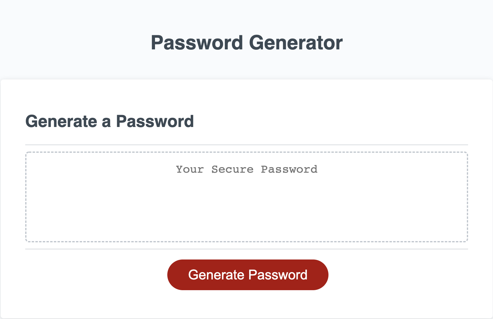
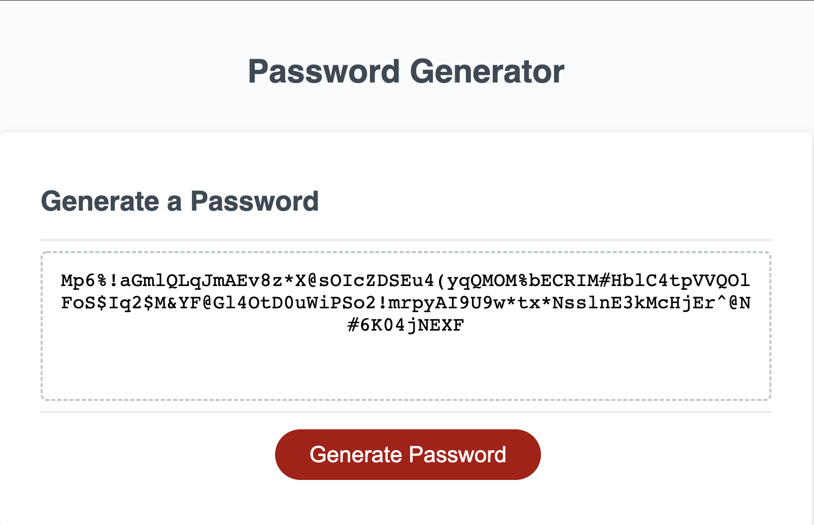

# Password Generator

## Application to generate a password given a users selected password length and criteria

The following application allows the user to generate a random password after selecting criteria. The user is first prompted to select a length of their password. The password must be between 8 and 128 characters and the application does not continue unless an appropriate length is chosen. 

Upon choosing the length of their generated password, the user is then asked to confirm which criteria they would like to include. The criteria includes uppercase letters, lowercase letters, numerical values and special characters. Atleast one of the criteria must be chosen to generate a password, and if the user fails to do this, they will be alerted and the criteria will be presented again. This will allow the user to once again select the criteria they wish to include in their password.

The following is a live link to the password generator application: https://charanvir.github.io/PasswordGenerator/

Below is a screenshot of the deployed application:
- 
- 